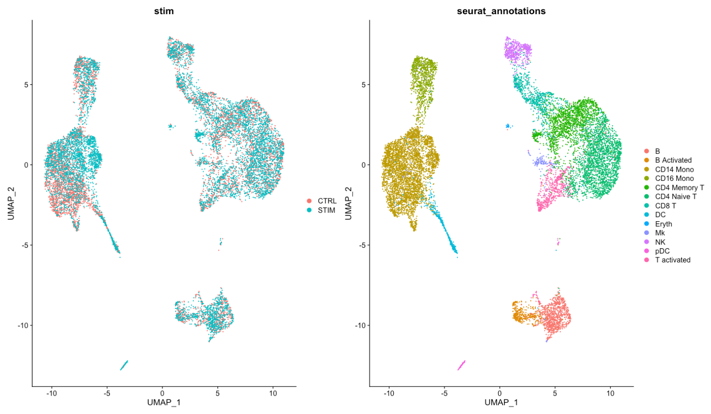
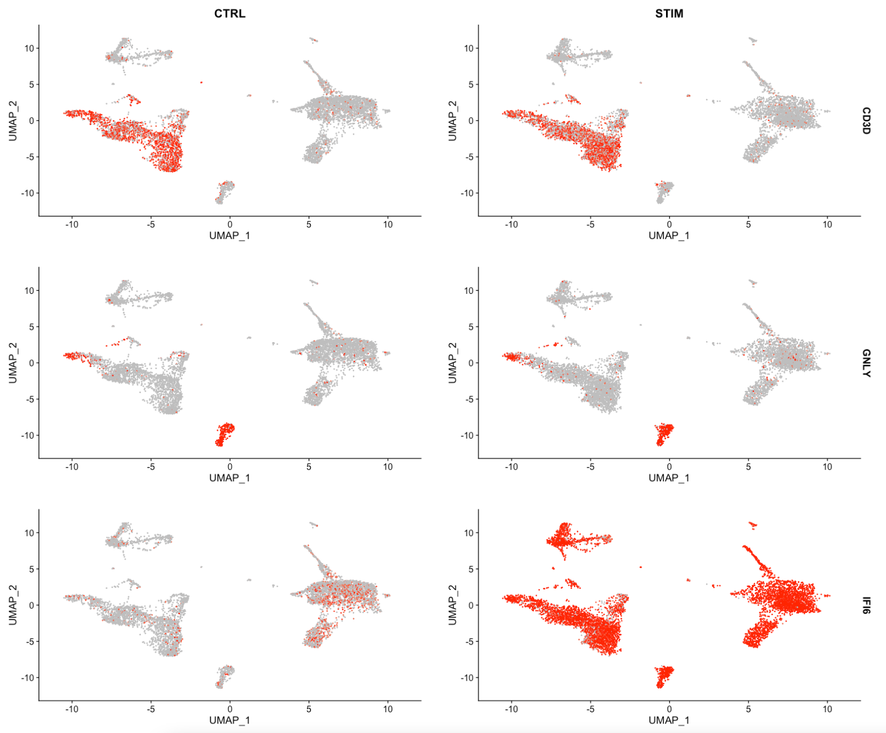

# scRNA-seq Pipeline Final Project

This repo contains the R Markdown files to replicate the scRNA-seq pipeline as described in this [paper](https://www.cell.com/cell/fulltext/S0092-8674(19)30559-8#secsectitle0075).

This pipeline utilizes the Seurat R package to perform the scRNA-seq analysis.

### Requirements
Computer with at least 5GB of free space to store analysis data files. Runtime is ~30 minutes.

### Downloading of Data:
  
`wget https://seurat.nygenome.org/src/contrib/ifnb.SeuratData_3.0.0.tar.gz`

### Final Output Figure
Visualization of differential gene expression.

Gene Expression

